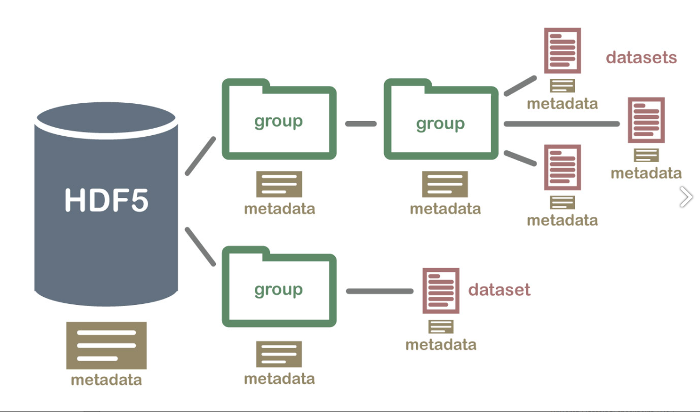

# [HDF5](https://wikidocs.net/24030)

- **hdf5**(Hierarchical Data Format version 5)는 대용량 데이터를 저장하기 위한 파일 포맷
- 일종의 고성능 DB라고 이해
- BSD 스타일의 라이선스를 채택하기때문에 수정, 배포, 상용 프로그램 사용 등에 자유로움
- 특징 요약
    - Easy sharing
    - Cross platform
    - Fast IO
    - Big Data
    - Heterogeneous data (여러 종류의 데이터)

## 파이썬 바인딩 h5py
- h5py와 PyTables 두가지 파이썬 바인딩이 있다.
- 여기에서는 h5py를 사용한다.
- Anaconda의 경우 h5py가 미리 설치되어 있으므로 별도의 추가 인스톨이 필요없다.
- 사용할 버전은 2.10.0이므로 업그레이드가 필요할 수 있다.

설치시(필요한 경우)
```bash
pip install h5py
```

설치시(업그레이드의 경우)
```bash
pip install h5py --upgrade
```

버전확인
```bash
import h5py       # 상단
h5py.__version__
'2.10.0'
```

- **바인딩**(binding)은 프로그래밍 언어가 해당 언어에 네이티브하지 않는 외부 라이브러리나 운영 체제 서비스를 사용할 수 있도록 만들어주는 글루 코드를 제공하는 API
- 프로그램의 기본 단위에 해당 기본 단위가 가질 수 있는 속성 중에서 일부 필요한 속성만을 선택하여 연결해 주는 것을 말함
- 바인딩은 일반적으로 하나를 다른 것으로 매핑시키는 것을 의미

## 특징
- HDF5를 이해하는 가장 중요한 개념은 **그룹(Group), 데이터셋(Dataset), 속성(attribute)**이다.
- 디렉토리 구조와 비슷한데, `그룹=디렉토리`, `데이터셋=파일`로 이해하면 쉽다.
- `속성은 일종의 메타데이터로 그룹이나 데이터셋을 부연 설명`하는 것을 의미한다.
- HDF5 파일을 생성하면 먼저 `/`라는 루트 그룹이 생성되고 그 하위에 트리 구조로 다른 그룹을 생성할 수 있다.
- 그룹하위에 다른 그룹이 있을 수도 있고, 데이터셋이 존재할 수도 있다.
    - 즉 완전히 운영체계의 디렉토리-파일 구조와 일치한다.
- 또 다른 특징은 속성인데 속성은 데이터셋이나 그룹을 설명하는데 사용하는데 이를 사용자가 정의하게 된다.
1. HDF5는 Hierarchical Data Format이며 self-describing이 되는 고성능 데이터포맷 또는 DB 정도로 이해
2. 운영체계와 무관하게 사용
3. 대용량 데이터를 빠르게 읽고 쓸 수 있다.
```bash
import numpy as np
import matplotlib.pyplot as plt
import h5py

#########################
# write

# station 15
temperature15 = np.random.random(1024)
wind15 = np.random.random(2048)

# station 20
temperature20 = np.random.random(1024)
wind20 = np.random.random(2048)


f = h5py.File('weather.hdf5','w')  # 'a'
f.attrs['descr'] = 'Temperature and wind data at HK mall'

f['/15/temperature'] = temperature15
f['/15/temperature'].attrs['dt'] = 10.0
f['/15/temperature'].attrs['start_time'] = 1375204299
f['/15/wind'] = wind15
f['/15/wind'].attrs['dt'] = 5.0

f['/20/temperature'] = temperature20
f['/20/temperature'].attrs['dt'] = 10.0
f['/20/temperature'].attrs['start_time'] = 1375204299
f['/20/wind'] = wind20
f['/20/wind'].attrs['dt'] = 5.0

f.close()


#########################
# read
f = h5py.File('weather.hdf5','r')
temp = f['15/temperature'][:]
dt = f['15/temperature'].attrs['dt']
f.close()

npoint = len(temp)
t = np.arange(0.,npoint*dt,dt)

plt.plot(t,temp)
plt.tight_layout()
plt.show()
```
- 생성된 HDF5 파일은 HDFView에서 편리하게 확인

## 파일과 그룹
### 파일
- hdf 파일 `h5py.File(name,mode=None, ...)` 형태로 객체를 생성하여 파일을 열게된다.
```bash
f = h5py.File('test.h5','w')
...
f.close()
``` 
- 모드에는 다음과 같은 5가지가 있다.
```bash
r : Readonly, file must exist
r+ : Read/write, file must exist
w : Create file, truncate if exists
w- : or `x` Create file, fail if exists
a : Read/write if exists, create otherwise (default)
```

### 그룹
- 그룹은 컨테이너 역할
- HDF5 파일에는 항상 루트 그룹 `/` 이 존재
- 파일객체는 루트 그룹으로 취급
- 그룹에 하위 그룹을 만드는 것은 `group.create_group(name, ...)` 로 생성
- 이때 `name`은 `/`로 시작하면 절대경로가, 그렇지 않으며 상대 경로가 사용

```bash
import numpy as np
import h5py

fdata = np.arange(10.)

f = h5py.File('group.h5','w')

f.create_group('1')
f.create_group('/2/1')

f['/2'].create_group('2')

f['/2'].create_group('/3/4/1')  #  f.create_group('/3/4/1')
f['/2'].create_group('3/4/1')  

f['/4/data'] = fdata    # f.create_dataset('/4/data',data=fdata)

f.close()
```

- 순차적으로 그룹을 만들지 않드라도 은연중에 그룹이 생성됨을 알 수 있다.
- 또한 `group.create_dataset(name,data=data)`로 데이터셋을 생성할 때 마찬가지이다.

- 위에서 생성한 파일의 구조는 다음과 같이 h5ls나 h5dump 유틸러티로 확인해 볼 수 있다. 또는 HDFView를 통해 시각적으로 확인

- 그룹의 중요 멤버는 `[key]`, `name`, `attrs` 등
```bash
>>> f = h5py.File('group.h5','r')
>>> f['/1']
<HDF5 group "/1" (0 members)>
>>> f['/1'].name
Out[94]: '/1'
```
- 순회가 필요하면 `keys()`, `items()`, `values()` 을 사용
```bash
for k in f.keys():
    print(f[k].name)

for k,v in f.items():
    print(k,v.name)

for v in f.values():
    print(v.name)
```
- 결과값
```bash
keys()
/1
/2
/3
/4
items()
1 /1
2 /2
3 /3
4 /4
values()
/1
/2
/3
/4
```

## 데이터셋(1)
### 기본 사항
- 데이터셋은 동일한 데이터타입을 갖는 수치로 이루어진 배열(1차던, 2차던, 고차던)을 저장
- numpy의 ndarray에 이름을 붙여 저장한다고 생각할 수 있다.

- 생성은 그룹의 멤버함수인 `create_dataset(...)` 로 생성
```bash
dataset = group.create_dataset(name,shape=None,dtype=None,data=None,...)
```

- 이미 만들어진 데이터셋의 중요 속성은 `name`, `shape`, `dtype` 이다. `ndarray`로 데이터를 지정할 때는 shape과 dtype을 지정할 필요없다.
```bash
import numpy as np
import h5py

fdata = np.arange(5.)

f = h5py.File('dataset.h5','w')

data1 = f.create_dataset('data1',data=fdata)   # same to f['data'] = fdata

print(data1.name)  # /data1
print(data1.shape)  # (5,)
print(data1.dtype)  #[  0. 500.   2.   3.   4.]
...
```

- 데이터셋을 억세스하는 것은 `ndarray`와 동일하게 `[]`를 이용한다(예전에서는 `dataset.value`로 직접 내부의 ndarray를 접근하였으나 depreciated 됨)로 가능하다. 아래와 같이 변경하면 바로 값이 변경
```bash
data1[1] = 500
data1[2:5] = -1.4
print(data1[:])
```

- 저장할 공간만 미리 정해 놓고 나중에 값을 대입하는 것은 다음과 같다.
- `flush()`를 사용하여 바로 쓰도록 해야 한다(호출하지 않으면 파일 닫힐 때 불림)
```bash
d = f.create_dataset('data2',shape=(5,),dtype='float')
d[:] = fdata
f.flush()
```

- 위에서 `dtype`을 직접 지정할 때는 numpy의 다양한 데이터타입이 가능하다( `dtype = numpy.float32`, `dtype = np.dtype('int')` 등등).
- NumPy 배열을 데이터로 지정하면서 dtype을 지정하면 형변환이 이루어지며 복사되게 된다.
```bash
f.create_data('data',data=fdata,dtype=np.dtype('float32'))
```

- 위에서 `fdata`의 `dtype`은 `float64` (64비트 실수)인데, 데이터셋의 `dtype`을 `float32`로 지정했기 때문에 32 비트 크기의 배열로 저장


### 크기가 변경가능한 데이터셋
- 데이터셋에 저장되는 배열은 `dataset.resize(tuple)`로 변경할 수 있다.
- 하지만 생성시 디폴트는 크기가 변경불가능
```bash
data = f.create_dataset('dset',(2,2),dtype='int')
print(data.shape)   # (2,2)
print(data.maxshape)   # (2,2)

d.resize((2,10))   # error
...
```

- 크기가 변경가능하게 하려면 `maxshape` 인자를 데이터셋을 생성할 때 지정해야 한다.
```bash
import numpy as np
import h5py

data = np.array([[1,2],[3,4]])

f = h5py.File('datasetresize.h5','w')

d = f.create_dataset('dset',(2,2),dtype='int',maxshape=(2,None))
print(d.shape)     # (2,2)
print(d.maxshape)  # (2,None)

d[:] = data

print(d[:])
d.resize((2,10))
print(d[:])
f.close()
```
- 위 코드는 처음 데이터셋을 생성할 때 (2,2) 로 생성하고, maxshape 인자에서 `None` 지정된 축으로 크기가 변경할 수 있다는 의미이다. 즉, (2, any) 형태로 변경할 수 있다.

